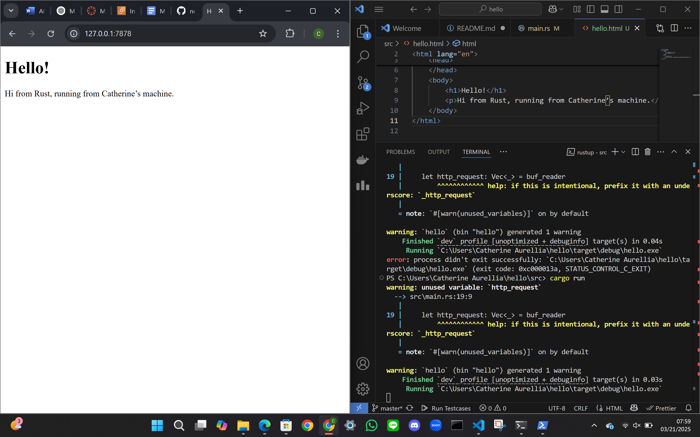
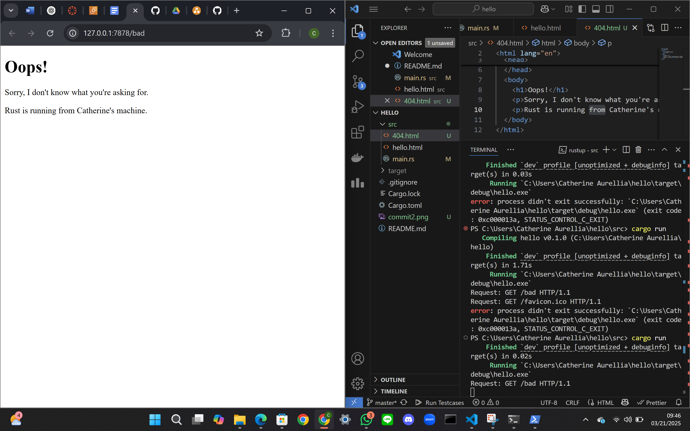

# Rust Web Server Project  

## Commit 1 Reflection Notes  

### Before Modification  
1. **No Request Handling**  
   - The server only accepted incoming connections but did not process client requests (e.g., an HTTP GET request).  
   - This meant the browser wouldn’t receive a valid response, leading to a timeout or a blank page.  

2. **Unused Stream Warning**  
   - The `stream` variable was declared but never used, causing a compiler warning.  

### After Modification  
1. **Implemented `handle_connection` Function**  
   - The function now reads, processes, and sends a response to the client.  

2. **Request Handling**  
   - The server reads incoming client requests (HTTP requests) using `stream.read()`.  

3. **Proper HTTP Response**  
   - The server sends a minimal HTTP response (`HTTP/1.1 200 OK` with `Hello, world!`).  
   - This ensures that visiting `http://127.0.0.1:7878` returns a valid response instead of timing out.  

4. **Resolved Unused Stream Warning**  
   - The `stream` variable is now actively used inside `handle_connection`.  

### Important Notes  
- A TCP server must process incoming data, not just accept connections.  
- A valid HTTP response is required for browsers to display content.  
- Rust enforces strict error handling, which helps catch issues early.  

---

## Commit 2 Reflection Notes  

### Enhancements & Key Takeaways  

1. **Buffered Input Handling**  
   - `BufReader::new(&mut stream)` is used to efficiently read from the TCP stream.  
   - The `.lines()` iterator reads the request line by line.  
   - Lines are collected until an empty line is encountered, marking the end of the HTTP request headers.  

2. **Static File Response**  
   - The server reads `hello.html` using `fs::read_to_string("hello.html").unwrap()`.  
   - The `Content-Length` header is calculated dynamically to ensure proper HTTP response formatting.  

3. **Error Handling Considerations**  
   - `.unwrap()` is currently used, which may cause a panic if the file is missing or unreadable.  
   - A more robust approach would be to implement graceful error handling (e.g., returning a `404 Not Found` for missing files).  

4. **Potential Improvements**  
   - **Dynamic Routing:** The current implementation only serves `hello.html`. Future updates could support different routes dynamically.  
   - **Logging & Debugging:** Adding logs to track incoming requests would help with debugging and monitoring.  
   - **Graceful Error Handling:** Instead of `unwrap()`, using `match` or `expect()` with meaningful error messages would improve stability.  

### Summary  
This commit enhances the server by properly handling HTTP requests and serving static files. It sets a foundation for further improvements in request handling, error management, and dynamic content rendering.  

### Screenshot  
  

---

## Commit 3 Reflection Notes  

### Validating Requests & Selectively Responding  

1. **Distinguishing Routes**  
   - The request line is now read separately and checked to determine the requested route.  
   - `GET / HTTP/1.1` serves `hello.html`, while any other request serves `404.html`.  

2. **Selective HTTP Response**  
   - The server now distinguishes between valid (`200 OK`) and invalid (`404 NOT FOUND`) requests.  
   - Instead of always serving `hello.html`, it now serves `404.html` when a bad request is made.  

3. **Refactoring for Readability & Maintainability**  
   - The logic for determining the response has been separated for clarity.  
   - This allows for easier extension in the future, such as adding more routes.  

### Need for Refactoring  

- **Code Organization:** Separating request parsing from response generation improves clarity.  
- **Scalability:** Future enhancements, like supporting more routes, will be easier to implement.  
- **Error Handling:** More precise error handling mechanisms can be added in the future.  

### Next Steps  

- Implement dynamic route handling for multiple pages.  
- Improve error handling to prevent server crashes from missing files.  
- Introduce logging for debugging request handling.  

### Screenshot  
  
